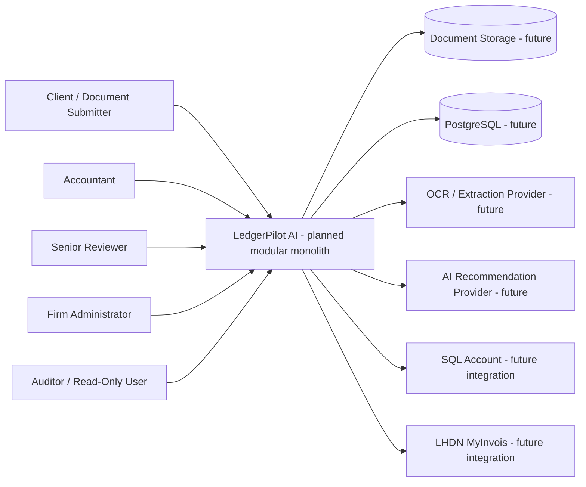
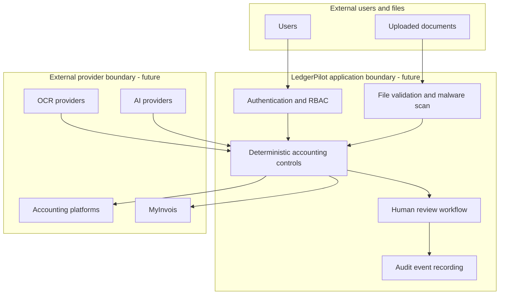

# Architecture

This document describes the proposed architecture direction. Phase 0 implements documentation, repository policy, and a minimal Python package-import scaffold only.

## Architecture Style

LedgerPilot AI should begin as a modular monolith. This keeps the domain model, review workflow, accounting controls, and integration boundaries coherent while the product requirements are still being validated.

Microservices are intentionally deferred.

## Proposed Technology Direction

Backend:

- Python 3.12.
- FastAPI.
- Pydantic.
- SQLAlchemy.
- Alembic.
- PostgreSQL.

Quality:

- Pytest.
- Ruff.
- Mypy.

Future optional components:

- Redis.
- Celery or alternative queue.
- React.
- TypeScript.
- Tesseract.
- PaddleOCR.
- Cloud document-processing APIs.
- Local machine-learning models.

## Implemented in Phase 0

- Documentation.
- Repository policy.
- GitHub issue and PR templates.
- Minimal `ledgerpilot` Python package.
- Import smoke test.
- Pytest, Ruff, and Mypy configuration.

## Not Implemented in Phase 0

- FastAPI application routes.
- Authentication.
- Persistence.
- OCR.
- AI extraction.
- Accounting recommendation logic.
- SQL Account integration.
- MyInvois integration.
- Production deployment.

## System Context



## Trust and Security Boundaries



Provider output enters the application as untrusted input. Core accounting controls must remain deterministic and provider-independent.

## Provider-Independent Boundaries

Future abstraction boundaries should exist for:

- OCR.
- Structured extraction.
- Document classification.
- AI recommendations.
- Accounting platform.
- MyInvois/e-Invoice.
- Document storage.

The core accounting model must not permanently depend on a commercial AI vendor or a single accounting platform.

## SQL Account Integration Direction

SQL Account is the first proposed external accounting-platform integration.

```text
LedgerPilot AI
      |
      v
Human Approved Transaction
      |
      v
AccountingPlatformGateway
      |
      v
SQLAccountGateway
      |
      v
SQL Account
```

LedgerPilot must not permanently depend on SQL Account. Future integration work should consider authentication, account retrieval, supplier retrieval, customer retrieval, tax-code retrieval, purchase invoice export, journal export, external document IDs, idempotency, retry behaviour, duplicate prevention, error recovery, and audit history.

The SQL Account API is not implemented in Phase 0.

## Malaysian Context Direction

Future Malaysian-context support should include MYR, Malaysian business identifiers, taxpayer identifiers, configurable Malaysian tax rules, SST-related configuration, LHDN MyInvois, e-Invoice submission, validation status, rejection, cancellation, validated identifiers, and integration audit history.

Current Malaysian accounting, taxation, privacy, and MyInvois rules must be independently verified before production use.

## Module Direction

Initial modules should align to business boundaries:

- `identity`: users, roles, permissions, tenant/client access.
- `documents`: document metadata, versions, files, validation, storage references.
- `extraction`: extraction runs, fields, confidence, provider abstraction.
- `accounting`: invoices, rules, recommendations, journals, tax codes, cost centres.
- `review`: review tasks, approvals, rejections, corrections, information requests.
- `audit`: append-only audit events and history queries.
- `integrations`: provider-independent gateways for export/submission.

## Architecture Risks

- Premature coupling to an AI vendor.
- Premature coupling to SQL Account.
- Implementing persistence before domain invariants are clear.
- Mixing administrative permissions with accounting approval authority.
- Treating future integrations as implemented capability.

## Validation Status

**Status: Provisional — requires technical investigation and practitioner validation.**
