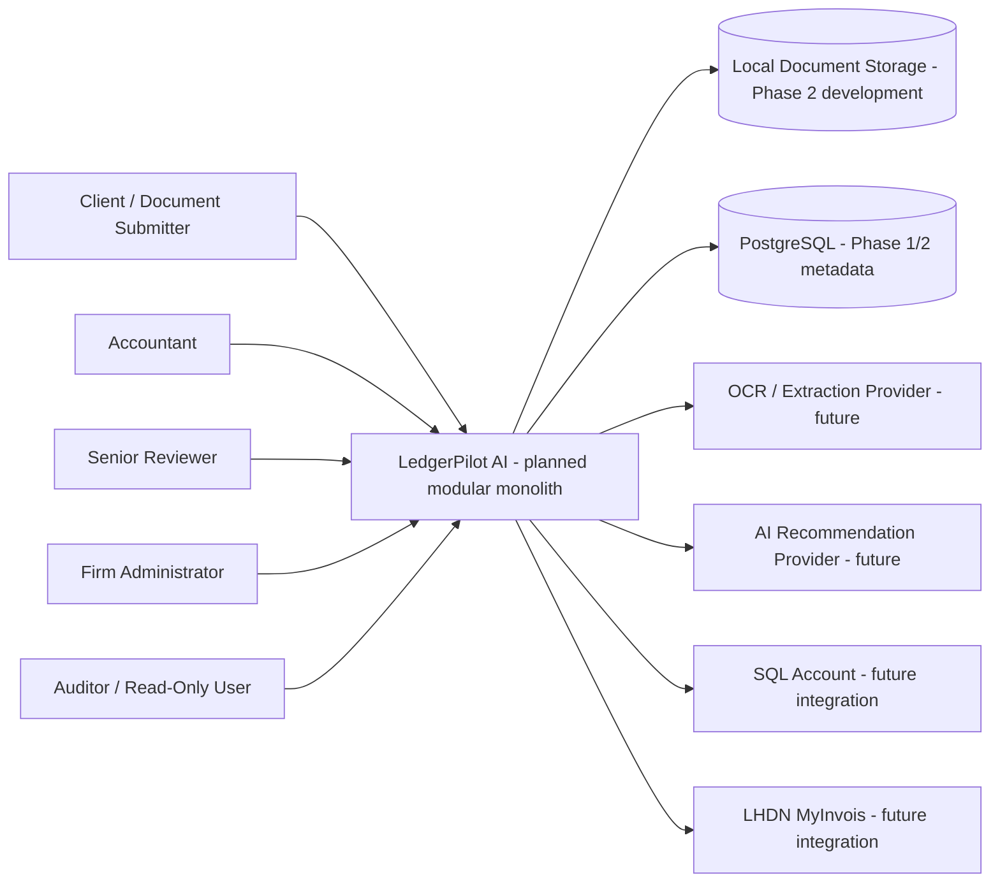
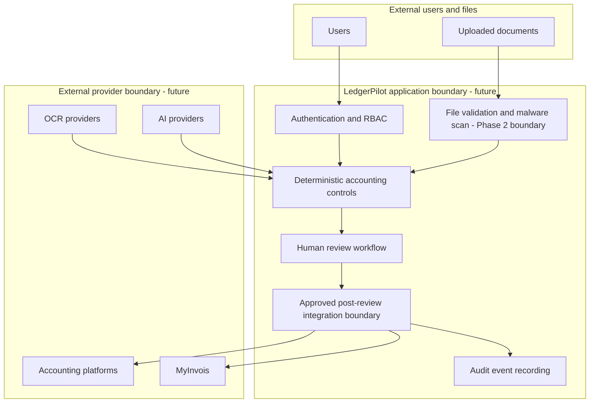

# Architecture

This document describes the architecture direction. Phase 2 implements secure document intake while preserving the Phase 0 modular-monolith direction.

## Architecture Style

LedgerPilot AI should begin as a modular monolith. This keeps the domain model, review workflow, accounting controls, and integration boundaries coherent while the product requirements are still being validated.

Microservices are intentionally deferred.

## Proposed Technology Direction

Backend:

- Python 3.12.
- FastAPI.
- Pydantic.
- SQLAlchemy.
- Alembic.
- PostgreSQL.

Quality:

- Pytest.
- Ruff.
- Mypy.

Future optional components:

- Redis.
- Celery or alternative queue.
- React.
- TypeScript.
- Tesseract.
- PaddleOCR.
- Cloud document-processing APIs.
- Local machine-learning models.

## Implemented Through Phase 2

- Documentation.
- Repository policy.
- GitHub issue and PR templates.
- Minimal `ledgerpilot` Python package.
- FastAPI application factory with versioned `/api/v1` routing.
- Liveness and readiness endpoints.
- Typed central configuration with Pydantic and `pydantic-settings`.
- PostgreSQL-targeted SQLAlchemy 2.x persistence foundation.
- Alembic migration configuration and initial infrastructure migration.
- Firm, user, firm-membership, client-entity, client-access, and audit-event models.
- Development-only authentication backend behind an authentication boundary.
- RBAC role and permission definitions aligned with Phase 0.
- Tenant/client-scoped repository methods.
- Append-oriented audit-event service.
- Safe structured API errors.
- Request correlation ID middleware.
- Docker Compose PostgreSQL development service.
- GitHub Actions CI for linting, formatting, type checking, tests, coverage, migrations, and build.
- Secure document-intake endpoint for PDF, JPEG, and PNG uploads.
- Protected document metadata endpoint.
- Document metadata and document-file persistence.
- Document lifecycle state machine through validation, scanning, quarantine, and stored states.
- Bounded streaming upload with SHA-256 calculation.
- Filename, size, MIME, extension, and file-signature validation.
- Provider-independent document storage boundary.
- Local development/test document storage with staging, accepted, and quarantine areas.
- Provider-independent malware scanner boundary.
- Deterministic development/test scanner with production guard.
- Document intake audit events.

## Planned Future Components

- Production authentication.
- Production object storage.
- Production malware scanning.
- Secure document download.
- OCR and extraction.
- AI recommendation providers.
- Accounting recommendation logic.
- Invoice, receipt, journal, review, reconciliation, and export workflows.
- SQL Account integration.
- MyInvois integration.
- Production deployment.

## System Context



## Trust and Security Boundaries



Provider output enters the application as untrusted input. Core accounting controls must remain deterministic and provider-independent. External accounting-platform and MyInvois/e-Invoice effects must be routed through an explicit approved post-review integration boundary; deterministic controls alone cannot trigger those effects.

## Phase 1 API Boundary

Phase 1 exposes only infrastructure endpoints:

- `GET /api/v1/health/live`
- `GET /api/v1/health/ready`
- `GET /api/v1/context`

The context endpoint is protected and exists only to prove authenticated principal construction. It is not a business workflow endpoint.

## Phase 2 Document Intake Boundary

Phase 2 exposes only document-intake metadata endpoints:

- `POST /api/v1/clients/{client_id}/documents`
- `GET /api/v1/clients/{client_id}/documents/{document_id}`

The upload endpoint requires `UPLOAD_DOCUMENTS` plus explicit firm and client scope. The metadata endpoint requires `VIEW_DOCUMENTS` plus explicit firm and client scope. Neither endpoint exposes raw file downloads, filesystem paths, storage roots, scanner internals, OCR output, invoice fields, accounting recommendations, journals, SQL Account, or MyInvois behaviour.

The implemented intake pipeline is:

```text
HTTP upload
  -> generated staging key
  -> bounded streaming write
  -> file validation and SHA-256
  -> malware scanner boundary
  -> accepted storage or quarantine
  -> document metadata and audit event
```

Local storage and the development scanner are for development and automated tests only. Production storage and production malware scanning are still planned.

## Phase 1 Authentication Boundary

Production authentication is intentionally not implemented in Phase 1. The code defines an authentication backend interface and a guarded development-only backend for local development and automated tests.

Development authentication:

- Is disabled by default.
- Requires `LEDGERPILOT_AUTH_MODE=development`.
- Requires `LEDGERPILOT_DEV_AUTH_ENABLED=true`.
- Is allowed only in `development` or `test`.
- Is rejected by settings validation in `production`.
- Accepts only a development subject and firm identifier from headers.
- Loads role, permissions, membership, and client access from controlled persistence.

Roles, permissions, and client access are not trusted from request headers.

## Provider-Independent Boundaries

Future abstraction boundaries should exist for:

- OCR.
- Structured extraction.
- Document classification.
- AI recommendations.
- Accounting platform.
- MyInvois/e-Invoice.
- Document storage.

The core accounting model must not permanently depend on a commercial AI vendor or a single accounting platform.

## SQL Account Integration Direction

SQL Account is the first proposed external accounting-platform integration.

```text
LedgerPilot AI
      |
      v
Human Approved Transaction
      |
      v
AccountingPlatformGateway
      |
      v
SQLAccountGateway
      |
      v
SQL Account
```

LedgerPilot must not permanently depend on SQL Account. Future integration work should consider authentication, account retrieval, supplier retrieval, customer retrieval, tax-code retrieval, purchase invoice export, journal export, external document IDs, idempotency, retry behaviour, duplicate prevention, error recovery, and audit history.

The SQL Account API is not implemented.

## Malaysian Context Direction

Future Malaysian-context support should include MYR, Malaysian business identifiers, taxpayer identifiers, configurable Malaysian tax rules, SST-related configuration, LHDN MyInvois, e-Invoice submission, validation status, rejection, cancellation, validated identifiers, and integration audit history.

Current Malaysian accounting, taxation, privacy, and MyInvois rules must be independently verified before production use.

## Module Direction

Initial modules should align to business boundaries:

- `identity`: users, roles, permissions, tenant/client access.
- `documents`: document metadata, versions, files, validation, storage references.
- `extraction`: extraction runs, fields, confidence, provider abstraction.
- `accounting`: invoices, rules, recommendations, journals, tax codes, cost centres.
- `review`: review tasks, approvals, rejections, corrections, information requests.
- `audit`: append-only audit events and history queries.
- `integrations`: provider-independent gateways for export/submission.

## Architecture Risks

- Premature coupling to an AI vendor.
- Premature coupling to SQL Account.
- Implementing persistence before domain invariants are clear.
- Mixing administrative permissions with accounting approval authority.
- Treating future integrations as implemented capability.

## Validation Status

**Status: Provisional — requires technical investigation and practitioner validation.**
