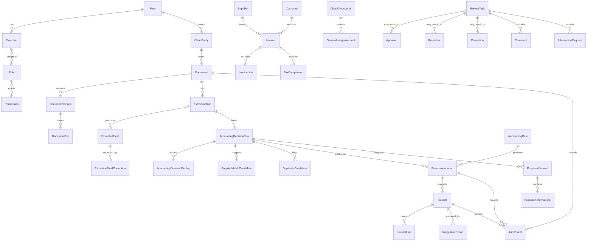

# Domain Model

This model combines implemented infrastructure entities with future conceptual accounting entities. Phase 1 implemented identity, tenant/client ownership, and audit primitives. Phase 2 implemented document and document-file metadata. Phase 3 implemented extraction runs, extracted fields, and extracted-field corrections. Phase 4 implements accounting decision runs, validation findings, supplier-match candidates, duplicate candidates, recommendations, proposed journals, and proposed journal lines. Approved invoices, review tasks, exports, and MyInvois records remain future concepts.

## Domain Diagram

## Concepts

| Concept | Purpose | Relationships and tenant ownership | Mutability and lifecycle | Audit implications |
| --- | --- | --- | --- | --- |
| Firm | Implemented accounting firm tenant. | Owns firm users, clients, configuration, rules, integrations, and audit scope. | Mutable administrative metadata; lifecycle from active to suspended/closed. | Firm-level configuration and access changes are auditable. |
| FirmUser | Implemented user operating inside a firm tenant. | Belongs to firm through memberships; assigned roles and client scopes. | Mutable authentication subject and active status. | Role, permission, and status changes are auditable. |
| Role | Implemented named access bundle. | Assigned through firm memberships; grants permissions. | Code-defined in Phase 1; future role administration must be audited. | Role changes affect control environment and require audit history. |
| Permission | Implemented atomic capability. | Granted through roles and checked against tenant/client scope. | Code-defined; additions require review. | Permission evaluation failures and grants may be security-relevant. |
| ClientEntity | Implemented client organisation or business represented by the firm. | Owned by firm; owns documents, future invoices, suppliers, customers, journals. | Mutable metadata; lifecycle active/inactive/archived. | Client access and data changes must be auditable. |
| ClientUser | External submitter or authorised viewer. | Belongs to client scope and may authenticate separately. | Mutable access status and contact details. | Access grants, uploads, and responses are auditable. |
| Document | Implemented logical supporting document metadata. | Owned by client entity; linked to files, extraction, future invoice/review. | State-driven; not silently overwritten. | State transitions and associations are auditable. |
| DocumentVersion | Version of document metadata/content interpretation. | Belongs to document; linked to file and extraction runs. | Append/supersede rather than overwrite. | Version creation and supersession require audit events. |
| DocumentFile | Implemented stored original file reference. | Belongs to document and storage provider with firm/client composite ownership. | Immutable file reference where possible; accepted/quarantine area is explicit. | Access and retention actions may be audited. |
| DocumentClassification | Document type/classification result. | Linked to document or extraction run. | May be corrected with history. | Classification source, confidence, and correction should be retained. |
| ExtractionRun | Implemented attempt to extract structured data. | Belongs to firm/client/document/document-file; references provider lineage. | Pending/running/succeeded/failed; terminal runs are not reset. | Provider, version, status, safe failure codes, and outputs are auditable. |
| ExtractedField | Implemented extracted value for a provider-independent field path. | Belongs to extraction run and retains document/client/firm scope. | Original extraction immutable; effective values use corrections. | Field source, confidence, and corrections are traceable. |
| FieldConfidence | Implemented as optional confidence on extracted fields. | Belongs to extracted field. | Immutable per extraction run. | Supports uncertainty review and model monitoring; not proof of correctness. |
| ExtractionFieldCorrection | Implemented append-only correction to an extracted field. | Belongs to field/run/document/client/firm and corrected-by membership/user. | Revisioned and append-only through application interfaces. | Correction reason, actor, timestamp, and revision are auditable. |
| AccountingDecisionRun | Implemented Phase 4 decision attempt. | Belongs to firm/client/document/extraction run and contains findings, matches, duplicate candidates, recommendations, and proposed journals. | Pending/running/succeeded/failed; terminal runs are not reset. Reruns create new attempts. | Start, success, and failure are audited with safe metadata. |
| AccountingDecisionFinding | Implemented Phase 4 deterministic flag or finding. | Belongs to an accounting decision run with full firm/client/document/extraction scope. | Immutable per run; rerun creates new findings. | Codes, severity, safe description, and safe evidence support review. |
| Supplier | Counterparty supplying goods/services. | Owned by client entity; linked to identifiers, invoices, rules. | Mutable through controlled changes; bank changes are high risk and out of MVP. | Supplier changes and matches are auditable. |
| Customer | Counterparty receiving goods/services. | Owned by client entity; linked to identifiers and invoices. | Mutable through controlled changes. | Customer changes and matches are auditable. |
| BusinessIdentifier | Registration, tax, or other identifier. | Belongs to supplier, customer, firm, or client. | Mutable with history; validated status may change. | Identifier validation and changes are auditable. |
| Invoice | Structured invoice representation. | Belongs to client entity and document; linked to lines, tax, supplier/customer, journal. | Draft until approved; later changes require correction/supersession. | Invoice field changes and approval decisions are auditable. |
| InvoiceLine | Line item on invoice. | Belongs to invoice; may link to GL recommendations. | Mutable before approval; later through correction workflow. | Line corrections affect accounting history. |
| TaxComponent | Tax amount/rate/code detail. | Belongs to invoice or invoice line; linked to tax code. | Requires expert-validated rules; mutable before approval. | Tax recommendations and corrections require traceability. |
| Currency | Currency code and precision. | Referenced by invoice, journal, bank transaction. | Reference data; rarely changes. | Currency changes can affect money interpretation and should be controlled. |
| ChartOfAccounts | Account catalogue for client or firm template. | Owned by client entity or firm template; contains GL accounts. | Configurable and versioned. | Account changes impact recommendations and exports. |
| GeneralLedgerAccount | Posting account. | Belongs to chart of accounts; used by journal lines and rules. | Mutable metadata; historical postings retain account reference/version. | Account mapping changes are auditable. |
| TaxCode | Tax classification/code. | Owned by client/firm configuration; referenced by recommendations and journals. | Configurable and versioned; requires expert validation. | Tax-code changes and use are auditable. |
| CostCentre | Optional reporting dimension. | Owned by client entity; referenced by recommendations/journal lines. | Mutable before approval; historical use retained. | Changes affect reporting lineage. |
| Department | Optional organisation dimension. | Owned by client entity; referenced by rules or journal lines. | Configurable lifecycle. | Changes are auditable where used in postings. |
| Project | Optional project/job dimension. | Owned by client entity; referenced by rules or journal lines. | Configurable lifecycle. | Changes are auditable where used in postings. |
| AccountingRule | Configurable rule for coding/routing. | Owned by firm/client; produces recommendations. | Versioned; changes do not rewrite prior recommendations. | Rule versions are part of recommendation lineage. |
| SupplierSpecificRule | Rule scoped to supplier. | Owned by client and supplier. | Versioned and reviewed. | Supplier-specific coding changes are auditable. |
| SupplierMatchCandidate | Implemented Phase 4 supplier match result. | Linked to an accounting decision run and scoped to firm/client/document/extraction. | Immutable per run; future supplier master-data changes do not rewrite old candidates. | Matching evidence, confidence, and matcher version are retained. |
| DuplicateCandidate | Implemented Phase 4 possible duplicate warning. | Linked to current decision run and prior same-scope candidate document/extraction/decision run. | Immutable warning; never auto-deletes, merges, approves, or rejects records. | Evidence signals and detector version are retained. |
| Recommendation | Implemented Phase 4 suggested accounting treatment. | Linked to accounting decision run, rules, confidence, evidence, and proposed journal context. | Immutable once issued; reruns produce new recommendations. | Explanation, confidence, rule/model versions, and timestamps are retained. |
| RecommendationExplanation | Human-readable reason. | Belongs to recommendation. | Immutable with recommendation. | Supports review, training, and dispute analysis. |
| RecommendationConfidence | Confidence or uncertainty indicator. | Belongs to recommendation. | Immutable with recommendation. | Must not be treated as proof of correctness. |
| RiskIndicator | Flag such as duplicate, high value, unusual supplier, low confidence. | Linked to document, invoice, recommendation, or review task. | Immutable per assessment; new assessment can supersede. | Risk routing and override decisions are auditable. |
| ProposedJournal | Implemented Phase 4 journal suggestion. | Linked to accounting decision run and source extraction/document. | Immutable proposed output for future review; not approved or exportable in Phase 4. | Decimal totals and balance state are retained. |
| ProposedJournalLine | Implemented Phase 4 proposed debit or credit line. | Belongs to proposed journal; references account, optional tax code, and optional cost centre. | Immutable per decision run. | Amount/account lineage supports future review. |
| Journal | Future approved accounting entry. | Linked to invoice, recommendation, approval, export. | Draft/review states arrive in Phase 5; approved immutable except correction/reversal/supersession. | Journal approval and correction are core audit events. |
| JournalLine | Future approved debit or credit line. | Belongs to journal; references GL account, tax code, dimensions. | Mutable before approval; immutable after approval. | Amount/account changes require traceability. |
| ReviewTask | Work item for accountant/senior reviewer. | Linked to document/invoice/recommendation/journal. | State-driven assignment and completion. | Assignment, escalation, and outcome are auditable. |
| Approval | Decision accepting work. | Linked to review task and approved journal. | Immutable decision record. | Actor, time, authority, and scope required. |
| Rejection | Decision rejecting work. | Linked to review task/document/invoice. | Immutable decision record. | Reason and actor required. |
| Correction | Attributable change to extracted/accounting data. | Linked to prior value, new value, reviewer, and target record. | Immutable correction record; may produce new version. | Preserves history and supports review. |
| Comment | Reviewer or submitter note. | Linked to review task, document, or information request. | Mutable only under controlled edit policy; preferably append-only. | Comments may support approval rationale and must avoid secrets. |
| InformationRequest | Request for missing/unclear information. | Linked to review task and submitter/client. | State-driven open/responded/closed/cancelled. | Requests and responses are auditable. |
| BankTransaction | Future bank feed/import item. | Owned by client entity; linked to reconciliation matches. | Imported immutable; enrichment uses versions/corrections. | Reconciliation and changes are auditable. |
| ReconciliationMatch | Candidate or approved match between bank transaction and accounting records. | Owned by client entity; linked to reviewer. | Candidate mutable; approved immutable. | Match decisions and reversals are auditable. |
| IntegrationExport | Export attempt to accounting platform. | Linked to approved journal and provider gateway. | Immutable attempt record with retry/status updates. | Idempotency keys, external IDs, errors, and actor/system are auditable. |
| MyInvoisSubmission | Future e-Invoice submission record. | Linked to invoice/client and MyInvois provider. | State-driven; updates retain external status history. | Validation, rejection, cancellation, IDs, and retries are auditable. |
| AuditEvent | Attributable event record. | Scoped to firm/client and target entity. | Append-only. | Core evidence source for review and audit. |
| RuleVersion | Specific version of accounting/routing/tax rule. | Linked to recommendations and decisions. | Immutable once active/used. | Enables explanation and rollback analysis. |
| ModelVersion | Specific AI/OCR/model/provider version. | Linked to extraction and recommendation outputs. | Immutable reference. | Enables drift, quality, and accountability review. |

## Open Modelling Questions

- Which entities must be firm-level templates versus client-level configuration?
- What is the minimum required audit-event schema?
- How should document versions relate to corrected structured data and Phase 4 decision reruns?
- Which supplier/customer identifiers are required in Malaysia for MVP and future MyInvois?
- Which synthetic Phase 4 rules should become configurable database-backed policy after practitioner validation?

**Status: Provisional — requires practitioner and technical validation.**
