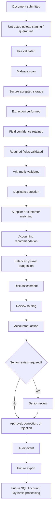
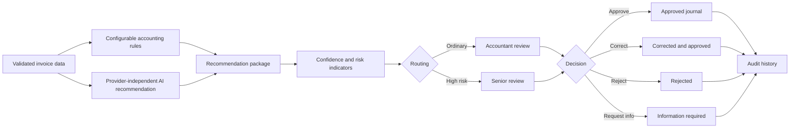
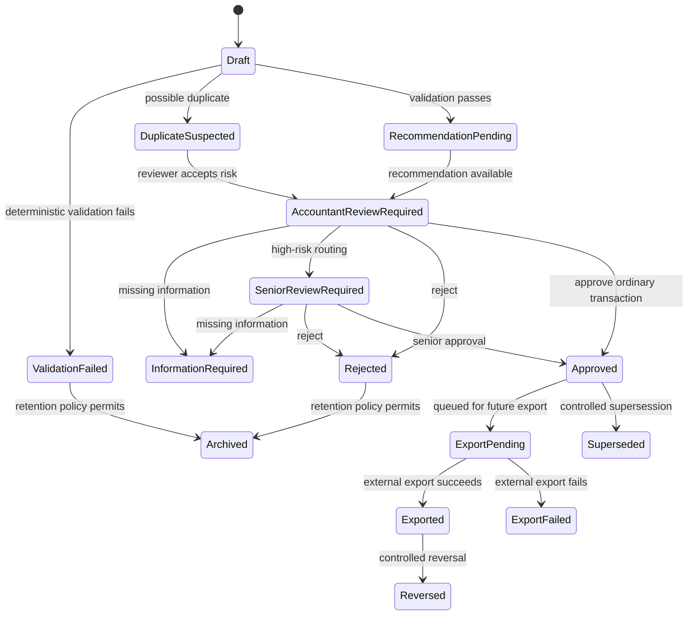

# Workflows and State Models

This document describes planned workflows and states. It is conceptual future functionality unless explicitly stated otherwise. Phase 0 implements documentation and minimal Python tooling only.

## Overall Document Processing Flow

## Recommendation and Review Workflow

## Document States

- Uploaded
- Untrusted Upload Staging
- Validating
- Validation Failed
- Malware Scan Pending
- Quarantined
- Stored
- Extraction Pending
- Extracting
- Extraction Failed
- Extracted
- Information Required
- Ready for Review
- Rejected
- Archived

## Accounting-Work States

- Draft
- Validation Failed
- Duplicate Suspected
- Recommendation Pending
- Accountant Review Required
- Senior Review Required
- Information Required
- Rejected
- Approved
- Export Pending
- Exported
- Export Failed
- Reversed
- Superseded

## Review States

- Unassigned
- Assigned
- In Review
- Escalated
- Information Requested
- Approved
- Corrected and Approved
- Rejected
- Cancelled

## Transaction Lifecycle

## Transition Requirements

| Transition | Actor | Permission | Preconditions | Validation | Audit event | Reversible? |
| --- | --- | --- | --- | --- | --- | --- |
| Uploaded -> Untrusted Upload Staging | Submitter, accountant, administrator | Upload documents | Tenant/client scope is authorised | File exists and metadata captured | Required | Yes, by rejection/archive |
| Untrusted Upload Staging -> Validating | System | File validation | Raw upload is staged outside accepted document storage | File is available for validation | Required | Yes, by rejection/quarantine |
| Validating -> Validation Failed | System | File validation | File fails allowlist, size, or integrity checks | Deterministic file validation | Required | Yes, with replacement upload |
| Validating -> Malware Scan Pending | System | File validation | File passes allowlist, size, and integrity checks | Validation result retained | Required | Yes, by rejection/quarantine |
| Malware Scan Pending -> Quarantined | System | File validation | Malware scan reports suspicious or unsafe content | Malware result retained | Required | Yes, by authorised security review or replacement upload |
| Malware Scan Pending -> Stored | System | File validation | Malware scan passes and tenant/client metadata is valid | Allowlist, size, integrity, and malware result retained | Required | No silent deletion; archive under retention |
| Stored -> Extraction Pending | System | Extraction scheduling | File stored and associated to tenant/client | Document type supported | Required | Yes, cancel/retry |
| Extraction Pending -> Extracting | System | Extraction execution | Work item available | Provider availability | Required | Retryable |
| Extracting -> Extraction Failed | System | Extraction execution | Extraction error or timeout | Error recorded | Required | Yes, retry or manual entry |
| Extracting -> Extracted | System | Extraction execution | Extraction completed | Field confidence retained | Required | Yes, superseded by later extraction run |
| Extracted -> Ready for Review | System | Review routing | Required and arithmetic validation pass | Duplicate/supplier/risk checks recorded | Required | Yes, reviewer may request info |
| Any reviewable -> Information Required | Accountant or senior reviewer | Request information | Missing or unclear information exists | Comment required | Required | Yes, submitter response returns to review |
| Ready for Review -> Duplicate Suspected | System or reviewer | Review recommendations | Duplicate indicators exceed threshold | Explanation retained | Required | Yes, reviewer resolves |
| Ready for Review -> Accountant Review Required | System | Review routing | Ordinary risk profile | Routing rules applied | Required | Yes, escalation possible |
| Accountant Review Required -> Senior Review Required | Accountant or system | Escalate | High risk, high value, exception, or override | Reason required | Required | Yes, senior may return or decide |
| Review Required -> Approved | Accountant or senior reviewer | Approve transaction | Balanced journal and controls pass | Debits equal credits; authority checked | Required | No direct overwrite; later correction/reversal/supersession |
| Review Required -> Corrected and Approved | Accountant or senior reviewer | Correct extracted info and approve | Correction is within authority | Revalidation required | Required | No direct overwrite; correction history retained |
| Review Required -> Rejected | Accountant or senior reviewer | Reject | Rejection reason supplied | Reason required | Required | Yes, duplicate upload or new document may restart |
| Approved -> Export Pending | System or authorised user | Export approved entries | Approved journal exists | Idempotency key created | Required | Yes, cancel if not exported |
| Export Pending -> Exported | Integration worker | Export approved entries | External platform accepts export | Idempotency and external ID retained | Required | Reversal/supersession required for accounting change |
| Export Pending -> Export Failed | Integration worker | Export approved entries | External platform rejects or times out | Error classified | Required | Yes, retry after remediation |
| Approved/Exported -> Reversed | Senior reviewer or controlled workflow | Correct approved records | Correction requires reversal | Reversal journal balances | Required | Supersession/reversal history retained |
| Approved/Exported -> Superseded | Senior reviewer or controlled workflow | Correct approved records | Corrected replacement is approved | Replacement journal balances | Required | Prior version remains immutable |

## Future SQL Account and MyInvois Flow

SQL Account and MyInvois processing are future capabilities. They must consume only human-approved, validated transactions and must retain export/submission status, external identifiers, errors, retries, and audit history.

## Open Validation Questions

- Which review states need service-level expectations?
- Which document states are visible to clients?
- Which rejection reasons must be standardised?
- Which transition reversals require senior reviewer approval?

**Status: Provisional — requires practitioner validation.**
