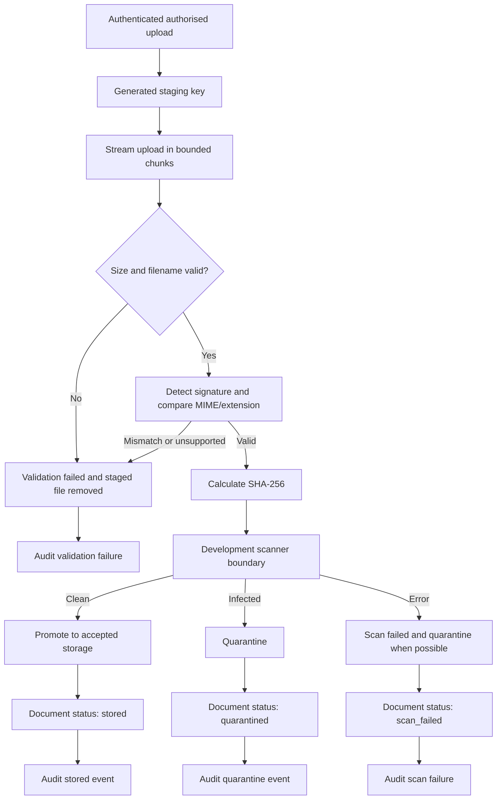
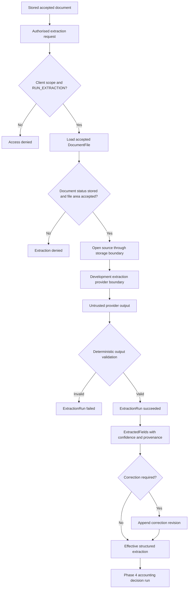
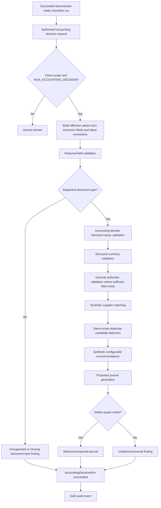
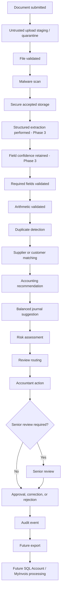
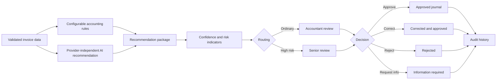
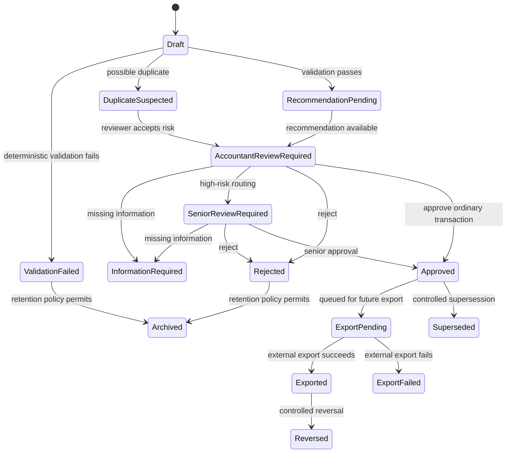

# Workflows and State Models

This document describes implemented and planned workflows and states. Phase 4 implements secure document intake, structured extraction, and accounting decision recommendations. Human review, approval, export, SQL Account, and MyInvois processing remain future functionality.

## Implemented Phase 2 Intake Flow

Implemented metadata endpoints expose safe document metadata only. There is no document download endpoint through Phase 3.

## Implemented Phase 3 Extraction Flow

The implemented extraction flow persists extraction runs, validated extracted fields, confidence, source provenance, and append-only correction history. It does not perform invoice arithmetic validation, supplier matching, accounting coding, journal generation, approvals, SQL Account export, or MyInvois submission.

## Implemented Phase 4 Accounting Decision Flow

Phase 4 creates recommendations only. Purchase-invoice-specific recommendations and journals are generated only for `purchase_invoice`. Unsupported document types, invalid monetary values, and invalid currency values create findings, not type-specific journals or persistence failures. Phase 4 does not approve, reject, route, export, post, pay, alter supplier bank details, or provide professional accounting/tax advice.

## Overall Document Processing Flow

## Recommendation and Review Workflow

## Implemented Phase 2 Document States

- Uploaded
- Validating
- Validation Failed
- Malware Scan Pending
- Scanning
- Scan Failed
- Quarantined
- Stored
- Rejected

## Implemented Phase 3 Extraction Run States

- Pending
- Running
- Succeeded
- Failed

Only succeeded extraction runs are downstream-ready for Phase 4 validation. Pending, running, and failed runs are not downstream-ready.

## Implemented Phase 4 Accounting Decision Run States

- Pending
- Running
- Succeeded
- Failed

Terminal accounting decision runs are not reset. A rerun creates a new decision run.

## Future Document/Review Preparation States

- Information Required
- Ready for Review
- Rejected
- Archived

## Accounting-Work States

- Draft
- Validation Failed
- Duplicate Suspected
- Recommendation Pending
- Accountant Review Required
- Senior Review Required
- Information Required
- Rejected
- Approved
- Export Pending
- Exported
- Export Failed
- Reversed
- Superseded

## Review States

- Unassigned
- Assigned
- In Review
- Escalated
- Information Requested
- Approved
- Corrected and Approved
- Rejected
- Cancelled

## Transaction Lifecycle

## Transition Requirements

| Transition | Actor | Permission | Preconditions | Validation | Audit event | Reversible? |
| --- | --- | --- | --- | --- | --- | --- |
| Uploaded -> Untrusted Upload Staging | Submitter, accountant, administrator | Upload documents | Tenant/client scope is authorised | File exists and metadata captured | Required | Yes, by rejection/archive |
| Untrusted Upload Staging -> Validating | System | File validation | Raw upload is staged outside accepted document storage | File is available for validation | Required | Yes, by rejection/quarantine |
| Validating -> Validation Failed | System | File validation | File fails allowlist, size, or integrity checks | Deterministic file validation | Required | Yes, with replacement upload |
| Validating -> Malware Scan Pending | System | File validation | File passes allowlist, size, and integrity checks | Validation result retained | Required | Yes, by rejection/quarantine |
| Malware Scan Pending -> Quarantined | System | File validation | Malware scan reports suspicious or unsafe content | Malware result retained | Required | Yes, by authorised security review or replacement upload |
| Malware Scan Pending -> Stored | System | File validation | Malware scan passes and tenant/client metadata is valid | Allowlist, size, integrity, and malware result retained | Required | No silent deletion; archive under retention |
| Stored -> Extraction Run Pending | Accountant or senior reviewer | Run extraction | Stored document and accepted DocumentFile exist; client scope authorised | Provider configured; source SHA retained | Required | Yes, retry creates a new run |
| Extraction Run Pending -> Running | System | Run extraction | Extraction run exists | Provider boundary receives only controlled context | Required | Retry creates a new run |
| Extraction Running -> Failed | System | Run extraction | Provider fails or output validation fails | Safe failure code retained; no successful fields from invalid output | Required | Retry creates a new run |
| Extraction Running -> Succeeded | System | Run extraction | Provider output validates | Field paths, confidence, source provenance, provider lineage retained | Required | New run supersedes by chronology only |
| Extracted Field -> Corrected Effective Value | Accountant or senior reviewer | Correct extracted information | Field belongs to authorised firm/client/document/run | Reason required; original field remains unchanged | Required | Yes, another correction revision |
| Extraction Run -> Accounting Decision Pending | Accountant or senior reviewer | Run accounting decision | Extraction run is succeeded and downstream-ready; client scope authorised | Effective values use latest corrections; original provider values remain unchanged | Required | Yes, rerun creates a new decision run |
| Accounting Decision Running -> Failed | System | Run accounting decision | Engine or persistence failure occurs | Safe failure code retained; no raw invoice payload in audit metadata | Required | Yes, retry creates a new decision run |
| Accounting Decision Running -> Succeeded | System | Run accounting decision | Decision package is persisted | Findings, supplier matches, duplicates, recommendations, proposed journal, and balance state retained | Required | Yes, rerun creates a new decision run |
| Accounting Decision -> Future Ready for Review | System | Review routing | Phase 5 only; not implemented in Phase 4 | Phase 4 findings and recommendations are available as input | Required in future | Yes, reviewer may request info |
| Any reviewable -> Information Required | Accountant or senior reviewer | Request information | Missing or unclear information exists | Comment required | Required | Yes, submitter response returns to review |
| Ready for Review -> Duplicate Suspected | System or reviewer | Review recommendations | Duplicate indicators exceed threshold | Explanation retained | Required | Yes, reviewer resolves |
| Ready for Review -> Accountant Review Required | System | Review routing | Ordinary risk profile | Routing rules applied | Required | Yes, escalation possible |
| Accountant Review Required -> Senior Review Required | Accountant or system | Escalate | High risk, high value, exception, or override | Reason required | Required | Yes, senior may return or decide |
| Review Required -> Approved | Accountant or senior reviewer | Approve transaction | Balanced journal and controls pass | Debits equal credits; authority checked | Required | No direct overwrite; later correction/reversal/supersession |
| Review Required -> Corrected and Approved | Accountant or senior reviewer | Correct extracted info and approve | Correction is within authority | Revalidation required | Required | No direct overwrite; correction history retained |
| Review Required -> Rejected | Accountant or senior reviewer | Reject | Rejection reason supplied | Reason required | Required | Yes, duplicate upload or new document may restart |
| Approved -> Export Pending | System or authorised user | Export approved entries | Approved journal exists | Idempotency key created | Required | Yes, cancel if not exported |
| Export Pending -> Exported | Integration worker | Export approved entries | External platform accepts export | Idempotency and external ID retained | Required | Reversal/supersession required for accounting change |
| Export Pending -> Export Failed | Integration worker | Export approved entries | External platform rejects or times out | Error classified | Required | Yes, retry after remediation |
| Approved/Exported -> Reversed | Senior reviewer or controlled workflow | Correct approved records | Correction requires reversal | Reversal journal balances | Required | Supersession/reversal history retained |
| Approved/Exported -> Superseded | Senior reviewer or controlled workflow | Correct approved records | Corrected replacement is approved | Replacement journal balances | Required | Prior version remains immutable |

## Future SQL Account and MyInvois Flow

SQL Account and MyInvois processing are future capabilities. They must consume only human-approved, validated transactions and must retain export/submission status, external identifiers, errors, retries, and audit history.

## Open Validation Questions

- Which review states need service-level expectations?
- Which document states are visible to clients?
- Which rejection reasons must be standardised?
- Which transition reversals require senior reviewer approval?

**Status: Provisional — requires practitioner validation.**
